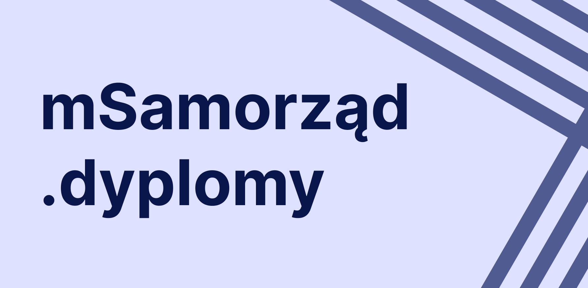
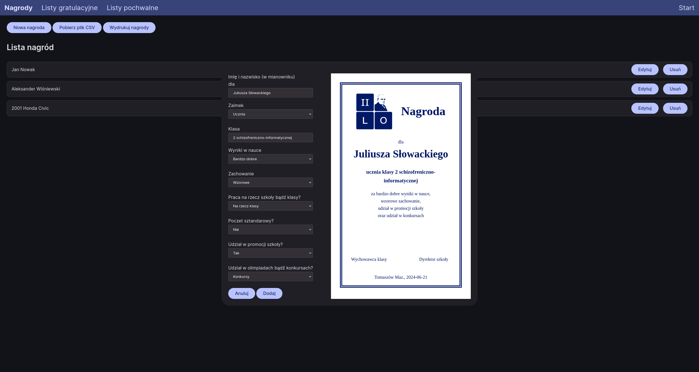

# mSamorząd.dyplomy
Webapp, który za pomocą łatwego w obsłudze interfejsu pozwala tworzyć nagrody, listy gratulacyjne i pochwalne.
W pliku index.html znajdują się szablony (#reward-template, #congratulations-template, #commendation-template), które można dopasować do swoich potrzeb.
Program jest udostępniony na licencji AGPLv3.

Wykorzystane biblioteki: Papa Parse (obsługa plików CSV), surreal.js